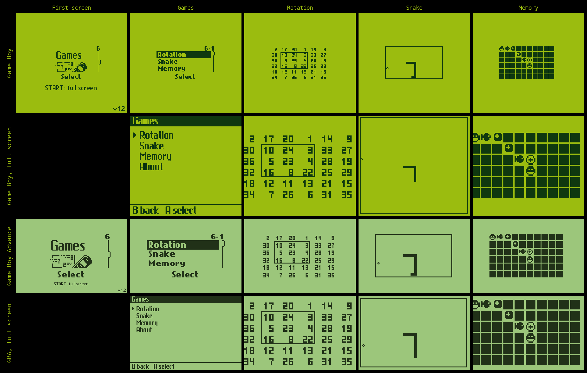
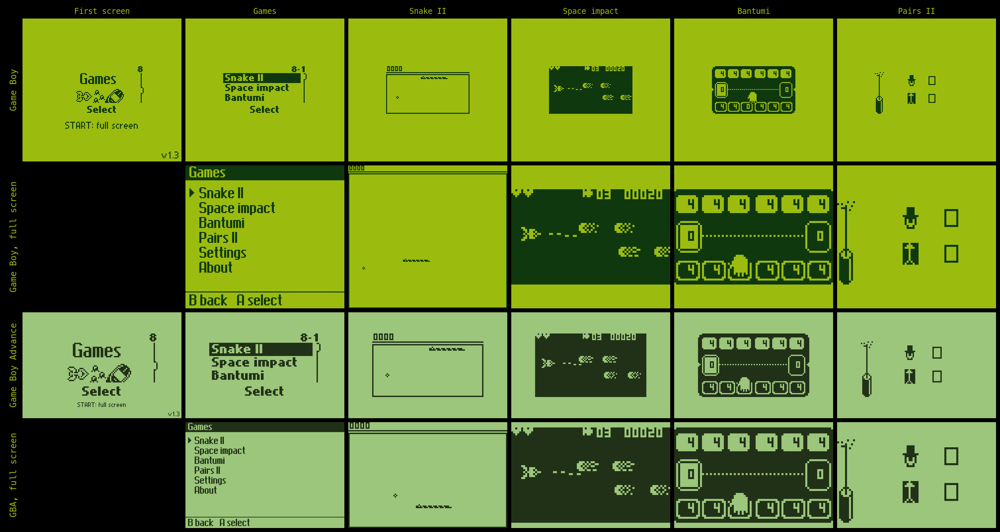
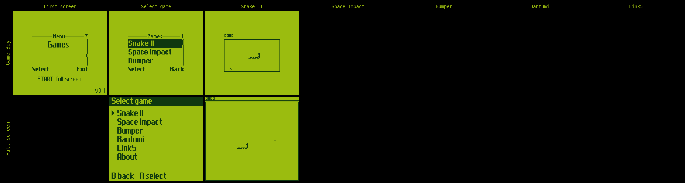

# Nokia phone games for Game Boy and Game Boy Advance

The built-in games of three Nokia phones, re-implemented in C from a map of
each phone's firmware and built as Game Boy (`.gb`) and Game Boy Advance
(`.gba`) ROMs. The games' pictures, fonts, text, levels and sounds are read
from your own firmware dump at build time; nothing from the firmware is in
this repository.

| Phone | Games | Game Boy | GBA |
|---|---|---|---|
| [Nokia 3210](3210/README.md) | Snake, Memory, Rotation | yes | yes |
| [Nokia 3310](3310/README.md) | Snake II, Space Impact, Bantumi, Pairs II | yes | yes |
| [Nokia 3410](3410/README.md) | Snake II so far; Space Impact is being mapped | yes | not yet |







Each game follows its phone's own: the menus, the speeds, the scoring, the
levels and the sounds, checked against the firmware running in MAME frame
by frame. Each ROM can also be played in a full-screen mode with menus of
its own, and there Snake is played on a board the size of the console's
screen.

The maps of the firmware, the tracing tools and the evidence are in a fork
of the Nokia DCT3 MAME project, <https://github.com/lukesau/nokia-dct3-re>
(branch `games/re-3310` and its `docs/games_*.md`).

## Layout

- `3210/`, `3310/`, `3410/`: one port per phone, each a project of its own
  with its Makefile, core, platform layers, tools and README.
- `common/`: the code the ports share: the LCD buffer and its blits, the
  font, the test card, the GBA linker script and libc, the host PGM writer,
  the frame and ROM tools and the mGBA setup script. Each port compiles it
  against its own `lcd.h`, so it draws at that phone's screen size.
- `tools/` (ignored): the SameBoy and mGBA clones the headless checks are
  built on, shared by the three ports (`make setup`).
- `Makefile`: runs a target in every port: `make gb`, `make gba`, `make
  test`, `make check-golden`, `make check-gb`, `make cards` and so on;
  `make -C 3310 <target>` runs one port's.

The ports began as three repositories and were brought together here with
their histories.

## Building

Each port's README says what it needs: its phone's firmware files, the
MAME fork (in whose `ports/` directory this repository is expected to sit,
for the extractors and the recorded reference runs), SDCC for the Game Boy
and `arm-none-eabi-gcc` for the GBA. Then, for example:

```
make setup        # SameBoy and mGBA for the headless checks
make -C 3310 dump # the flash image from the firmware files
make gb gba
make cards        # copy the ROMs to the flash carts
```

## Firmware policy

No Nokia firmware, no extracted code or data from it, and nothing derived
from a firmware image is committed here. Dumps, extracted assets, recorded
MAME frames and build output are all ignored.

## License

GNU Affero General Public License v3; see `LICENSE`.
